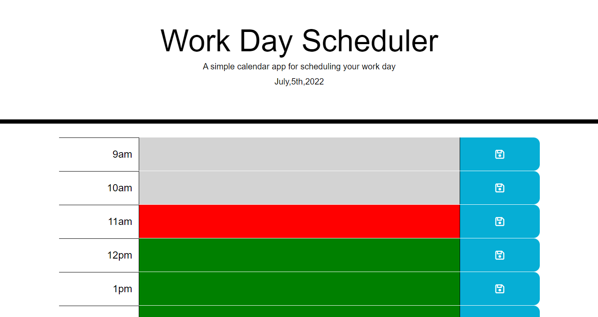

# Daily-Task-Tracker

## How to use

When the user loads the page, they will see the current date, as well as the hours colored based on the time of day. They can begin to create and edit task for specific hours. Once they click the save icon, their for that hour will be saved and still displayed when they reload the page.

## Algorithms

*The JS uses military time, as it is easier to use logic on a single 24 hour scale, and not need to convert them. When Displayed the millitary time is converted to standard time.*

#### Getting the schedule from the local stoarage

1. a variable is made getting 'storedSchedule' from the local storage
2. an if statment checks the contents of the varable,if the date doesnt match the current day, or the array is null a new schedule is created and pushed to the local storage.

#### Displaying the task

1. a forEach method is used to loop through an array of objects holding the schedule information
2. comparing the current time in military hours to the current task hour in millitary hours will determine the color of the task
3. a Div is created for the row, as well as a div for the: hour,task, and save icon.
4. each div is given their own attrabutes
5. all the divs are then appended to the page

#### Saving the task

1. variables are created holding the task and hour of the row saved
2. it loops through the schedule array and changes the task when selected hour and schedule hour match
3. the array is then pushed to the local storage

## Live Demo
A live verstion of the code can be found [here](https://jadentr44.github.io/Daily-Task-Tracker/)

## Credits

All of the Javascript was written and planned out by [Jaden Rodriguez](https://github.com/Jadentr44)

The css was provided (and edited by Jaden) from the UT Austin coding boot camp repository starter code for challenge 03.

The Jquery and Bootsrap frameworks were used to create this project
